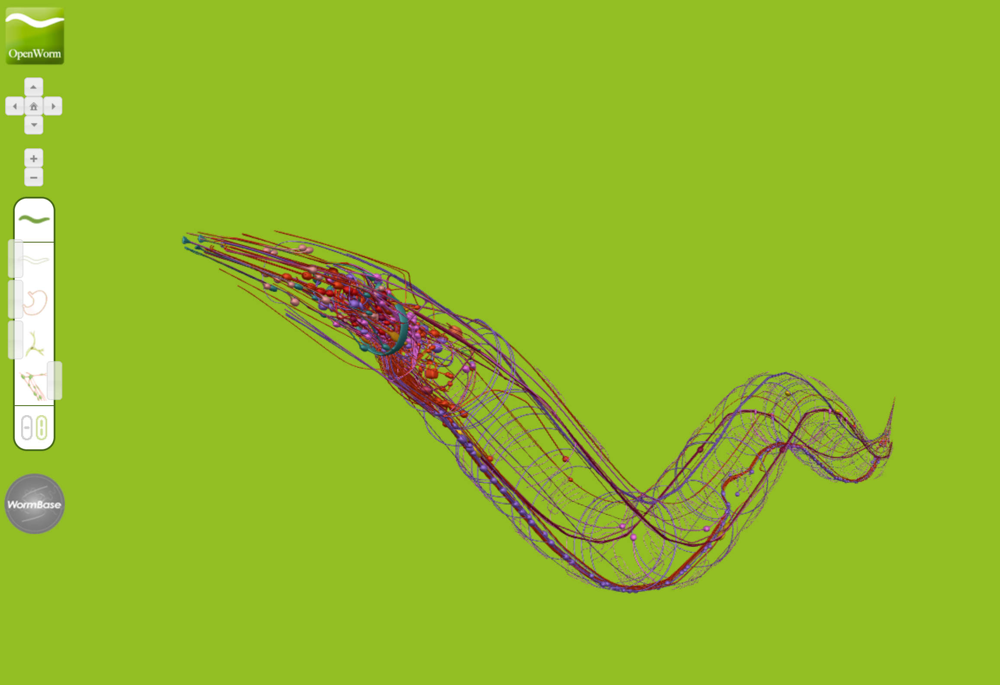

OpenWorm Browser
==========================

A WebGL based _C. elegans_ body browser implemented as part of the OpenWorm project. 

The 3D _C. elegans_ neurons are provided by the [VirtualWorm project](http://caltech.wormbase.org/virtualworm). We are using the [open-3d-viewer](http://code.google.com/p/open-3d-viewer/) as WebGl engine.

The OpenWorm Browser can be accessed [here](http://browser.openworm.org/).

The source code for this project can be found [here](https://github.com/openworm/wormbrowser). 