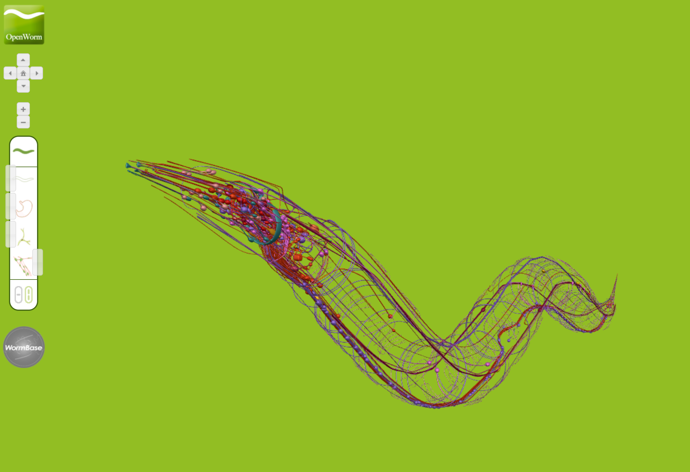

OpenWorm Browser
==========================

A WebGL based _C. elegans_ body browser implemented as part of the OpenWorm project. 

The 3D _C. elegans_ neurons are provided by the [VirtualWorm project](https://caltech.wormbase.org/virtualworm). We are using the [open-3d-viewer](https://code.google.com/p/open-3d-viewer/) as WebGl engine.

The OpenWorm Browser can be accessed [here](https://browser.openworm.org/).

The source code for this project can be found [here](https://github.com/openworm/wormbrowser).

!!! note "Future Visualization"
    The next-generation visualization is specified by [DD014: Dynamic Visualization Architecture](../design_documents/DD014_Dynamic_Visualization_Architecture.md), which plans a Trame-based viewer evolving toward **WormSim 2.0** — a public Three.js + WebGPU site at wormsim.openworm.org. The WormBrowser at browser.openworm.org will continue to be maintained until WormSim 2.0 achieves full feature parity (see DD014 deployment timeline).

---

## Continue Reading

- **[DD014: Dynamic Visualization](../design_documents/DD014_Dynamic_Visualization_Architecture.md)** — The next-generation viewer architecture
- **[Archived Projects](../archived_projects.md)** — Historical context for Geppetto and other visualization efforts
- **[Projects Overview](../projects.md)** — All active projects and their governing DDs