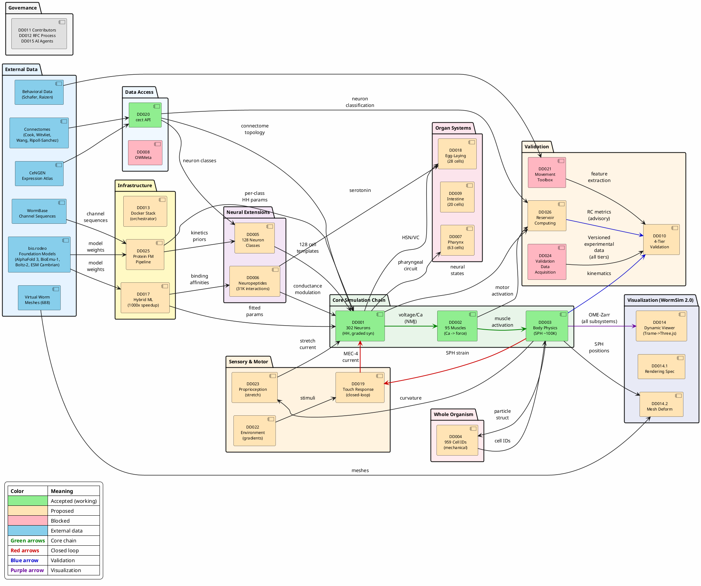

# OpenWorm Integration Map
- **Version:** 1.1
- **Created:** 2026-02-19
- **Updated:** 2026-02-22
- **Purpose:** Master coupling dependency graph showing how all Design Documents fit together

---

## Mission Alignment

**OpenWorm Mission:** "Creating the world's first virtual organism in a computer, a *C. elegans* nematode." (openworm.org)

**This Integration Map shows:** How 27 Design Documents compose into that virtual organism — each DD specifies one subsystem (neurons, muscles, body physics, pharynx, intestine, etc.), and this map shows how they couple together to produce emergent whole-organism behavior.

**Core Principle:** "Worms are soft and squishy. So our model has to be too. We are building in the physics of muscles, soft tissues and fluids. Because it matters."

**This Map enforces:** The coupling contracts that ensure physical realism — muscle calcium drives body forces ([DD002](DD002_Muscle_Model_Architecture.md)→[DD003](DD003_Body_Physics_Architecture.md)), body deformation feeds back to sensory neurons ([DD003](DD003_Body_Physics_Architecture.md)→[DD019](DD019_Closed_Loop_Touch_Response.md)), neuropeptide diffusion modulates neural excitability ([DD006](DD006_Neuropeptidergic_Connectome_Integration.md)→[DD001](DD001_Neural_Circuit_Architecture.md)), and protein foundation models predict channel kinetics from sequence ([DD025](DD025_Protein_Foundation_Model_Pipeline.md)→[DD005](DD005_Cell_Type_Differentiation_Strategy.md)→[DD001](DD001_Neural_Circuit_Architecture.md)). Every coupling is physically meaningful, not a black-box function call.

---

## Purpose

This document visualizes **how all Design Documents couple together** at the architectural level:

- Which DDs produce data (sources)
- Which DDs consume data (sinks)
- What breaks if coupling interfaces change
- Bottleneck analysis (which DDs are critical dependencies)

**Companion to DD_PHASE_ROADMAP.md:**

- Phase Roadmap: **When** to implement (timeline view)
- Integration Map: **How** they connect (architecture view)

- **Generated from:** Integration Contract sections of [DD001](DD001_Neural_Circuit_Architecture.md)-[DD026](DD026_Reservoir_Computing_Validation.md)
- **Last updated:** 2026-02-22

---

## Complete Dependency Graph

**Reading guide:** DDs are grouped into functional clusters. Arrows show major data flows between clusters (not every internal edge). Color-coded: green = core chain, red = closed-loop, blue = validation, purple = visualization. The 4 chain diagrams below show detailed data flow for each pathway.

<object data="../../images/integration_map.svg" type="image/svg+xml" style="width:100%; max-width:1200px;">OpenWorm Integration Map — click any DD to navigate to its design document</object>

<details>
<summary>PlantUML Source (click to expand)</summary>



</details>

**To re-render:** Use PlantUML online (plantuml.com/plantuml) or local PlantUML jar:
```bash
java -jar plantuml.jar INTEGRATION_MAP.md
# Generates INTEGRATION_MAP.png
```

---

## Bottleneck Analysis (Most-Depended-On DDs)

**Critical Dependencies** — These DDs are consumed by the most others. Changes to their output interfaces ripple widely.

| DD | Depended On By (count) | Consumers | Criticality | Owner |
|----|----------------------|-----------|-------------|-------|
| **[DD001](DD001_Neural_Circuit_Architecture.md)** (Neural Circuit) | **12 DDs** | [DD002](DD002_Muscle_Model_Architecture.md), [DD005](DD005_Cell_Type_Differentiation_Strategy.md), [DD006](DD006_Neuropeptidergic_Connectome_Integration.md), [DD007](DD007_Pharyngeal_System_Architecture.md), [DD009](DD009_Intestinal_Oscillator_Model.md), [DD010](DD010_Validation_Framework.md), [DD013](DD013_Simulation_Stack_Architecture.md), [DD014](DD014_Dynamic_Visualization_Architecture.md), [DD017](DD017_Hybrid_Mechanistic_ML_Framework.md), [DD018](DD018_Egg_Laying_System_Architecture.md), [DD019](DD019_Closed_Loop_Touch_Response.md), [DD025](DD025_Protein_Foundation_Model_Pipeline.md) | 🔴 **CRITICAL BOTTLENECK** | Neural Circuit L4 Maintainer |
| **[DD003](DD003_Body_Physics_Architecture.md)** (Body Physics) | **7 DDs** | [DD004](DD004_Mechanical_Cell_Identity.md), [DD007](DD007_Pharyngeal_System_Architecture.md), [DD010](DD010_Validation_Framework.md), [DD013](DD013_Simulation_Stack_Architecture.md), [DD014](DD014_Dynamic_Visualization_Architecture.md), [DD014.2](DD014.2_Anatomical_Mesh_Deformation_Pipeline.md), [DD019](DD019_Closed_Loop_Touch_Response.md) | 🔴 **CRITICAL** | Body Physics L4 Maintainer |
| **[DD020](DD020_Connectome_Data_Access_and_Dataset_Policy.md)** (Connectome) | **9 DDs** | [DD001](DD001_Neural_Circuit_Architecture.md), [DD002](DD002_Muscle_Model_Architecture.md), [DD005](DD005_Cell_Type_Differentiation_Strategy.md), [DD006](DD006_Neuropeptidergic_Connectome_Integration.md), [DD007](DD007_Pharyngeal_System_Architecture.md), [DD013](DD013_Simulation_Stack_Architecture.md), [DD017](DD017_Hybrid_Mechanistic_ML_Framework.md), [DD018](DD018_Egg_Laying_System_Architecture.md), [DD019](DD019_Closed_Loop_Touch_Response.md) | 🔴 **CRITICAL FOUNDATION** | TBD (Data L4) |
| [DD002](DD002_Muscle_Model_Architecture.md) (Muscle) | 5 DDs | [DD003](DD003_Body_Physics_Architecture.md), [DD007](DD007_Pharyngeal_System_Architecture.md), [DD010](DD010_Validation_Framework.md), [DD013](DD013_Simulation_Stack_Architecture.md), [DD014](DD014_Dynamic_Visualization_Architecture.md), [DD017](DD017_Hybrid_Mechanistic_ML_Framework.md), [DD018](DD018_Egg_Laying_System_Architecture.md) | 🟡 Moderate | TBD (Muscle L4) |
| [DD005](DD005_Cell_Type_Differentiation_Strategy.md) (Cell-Type Specialization) | 6 DDs | [DD006](DD006_Neuropeptidergic_Connectome_Integration.md), [DD010](DD010_Validation_Framework.md), [DD014](DD014_Dynamic_Visualization_Architecture.md), [DD017](DD017_Hybrid_Mechanistic_ML_Framework.md), [DD018](DD018_Egg_Laying_System_Architecture.md), [DD025](DD025_Protein_Foundation_Model_Pipeline.md) | 🟡 Moderate (Phase 1+) | Neural Circuit L4 Maintainer |
| [DD025](DD025_Protein_Foundation_Model_Pipeline.md) (Foundation Models) | 2 DDs | [DD001](DD001_Neural_Circuit_Architecture.md) (per-class HH params), [DD005](DD005_Cell_Type_Differentiation_Strategy.md) (kinetics priors) | 🟡 Moderate (Phase A+) | TBD (ML L4) |
| [DD017](DD017_Hybrid_Mechanistic_ML_Framework.md) (Hybrid ML) | 2 DDs | [DD001](DD001_Neural_Circuit_Architecture.md) (fitted params), [DD006](DD006_Neuropeptidergic_Connectome_Integration.md) (binding affinities) | 🟡 Moderate (Phase 3+) | TBD (ML L4) |
| [DD013](DD013_Simulation_Stack_Architecture.md) (Integration) | **0 DDs** | (Orchestrator — no one depends on it) | ℹ️ **LEAF NODE** | TBD (Integration L4) — **VACANT** |
| [DD014](DD014_Dynamic_Visualization_Architecture.md) (Visualization) | **0 DDs** | (Consumer only — no one depends on it) | ℹ️ **LEAF NODE** | TBD (Visualization L4) |
| [DD021](DD021_Movement_Analysis_Toolbox_and_WCON_Policy.md) (Toolbox) | 1 DD | [DD010](DD010_Validation_Framework.md) (Tier 3 only) | 🟡 **BLOCKING** (for validation) | TBD (Validation L4) — **VACANT** |

### Phase Legend

| DD | Roadmap Phase | Status |
|----|--------------|--------|
| DD001 (Neural Circuit) | Phase 0 | Accepted |
| DD002 (Muscle) | Phase 0 | Accepted |
| DD003 (Body Physics) | Phase 0 | Accepted |
| DD020 (Connectome) | Phase 0 | Accepted |
| DD013 (Simulation Stack) | Phase A | Proposed |
| DD021 (Movement Toolbox) | Phase A | Blocked |
| DD005 (Cell-Type Specialization) | Phase 1 | Proposed |
| DD010 (Validation Framework) | Phase 1 | Proposed |
| DD014 (Visualization) | Phase 1-4 | Proposed |
| DD025 (Foundation Models) | Phase A | Proposed |
| DD017 (Hybrid ML) | Phase 3 | Proposed |

**Key Insight:**

- **[DD001](DD001_Neural_Circuit_Architecture.md) is the central hub** — 12 other DDs depend on it. Any change to neural output format (calcium variables, voltage traces, OME-Zarr schema) affects almost everything.
- **[DD013](DD013_Simulation_Stack_Architecture.md) and [DD014](DD014_Dynamic_Visualization_Architecture.md) are pure consumers** — They orchestrate/visualize but don't produce data that other DDs depend on. This is correct (leaf nodes in the dependency graph).
- **[DD020](DD020_Connectome_Data_Access_and_Dataset_Policy.md) is the foundational data layer** — 9 DDs pull connectome data from it. If `cect` API changes or default dataset switches, widespread updates needed.
- **[DD025](DD025_Protein_Foundation_Model_Pipeline.md) and [DD017](DD017_Hybrid_Mechanistic_ML_Framework.md) are ML feeders** — They consume external foundation models ([bio.rodeo](https://bio.rodeo/models)) and produce predicted parameters for the mechanistic core. DD025 feeds DD001/DD005 (channel kinetics); DD017 feeds DD001 (fitted params) and DD006 (binding affinities).

---

## Coupling Chains (Data Flow Sequences)

### Chain 1: The Core Loop (Neural → Muscle → Body → Validation)

**Primary data flow** through the simulation:

<object data="../../images/chain1_core_loop.svg" type="image/svg+xml" style="width:100%; max-width:900px;">Chain 1: Core Loop</object>

**Coupling scripts:**

- NeuroML/LEMS handles [DD001](DD001_Neural_Circuit_Architecture.md)→[DD002](DD002_Muscle_Model_Architecture.md) (within same simulation)
- `sibernetic_c302.py` handles [DD002](DD002_Muscle_Model_Architecture.md)→[DD003](DD003_Body_Physics_Architecture.md) (file-based coupling)
- WCON exporter in `master_openworm.py` handles [DD003](DD003_Body_Physics_Architecture.md)→[DD021](DD021_Movement_Analysis_Toolbox_and_WCON_Policy.md)
- Validation scripts handle [DD021](DD021_Movement_Analysis_Toolbox_and_WCON_Policy.md)→[DD010](DD010_Validation_Framework.md)

**Phase Status:** The core loop (DD001→DD002→DD003→DD021→DD010) is the only coupling chain that is **fully working today** (Phase 0). All other chains (Cell-Type, Closed-Loop, Visualization, Foundation Models) are Phase 1+.

**Two trajectory generation paths (both produce WCON 1.0):**

| Path | Tool | Physics | Speed | Use Case |
|------|------|---------|-------|----------|
| **2D fast path** | `boyle_berri_cohen_trajectory.py` (c302 repo) | 2D rod-spring, ~150 variables | Seconds (CPU) | CI quick-test, parameter sweeps, DD017 training data |
| **Sibernetic full path** | `sibernetic_c302.py` → Sibernetic → `wcon/generate_wcon.py` (existing) or `extract_trajectory.py` (DD001 Issue 2) | 3D SPH, ~100K particles | Minutes-hours (GPU) | Publication validation, 3D analysis, DD019 strain |

Both paths feed identically into [DD021](DD021_Movement_Analysis_Toolbox_and_WCON_Policy.md) → [DD010](DD010_Validation_Framework.md). The 2D fast path wraps the Boyle, Berri & Cohen (2012) published rod-spring model, already implemented in `openworm/CE_locomotion`, `openworm/Worm2D`, and `openworm/CelegansNeuromechanicalGaitModulation`.

**Phase Status:** The Sibernetic full path works today (Phase 0). The 2D fast path (`boyle_berri_cohen_trajectory.py`) is a Phase A deliverable (DD001 Issue 1).

**2D model limitations:** 2D only. Cannot replace Sibernetic for [DD004](DD004_Mechanical_Cell_Identity.md) (cell identity), [DD019](DD019_Closed_Loop_Touch_Response.md) (3D cuticle strain), [DD014.2](DD014.2_Anatomical_Mesh_Deformation_Pipeline.md) (mesh deformation), or Phase 3+ organ systems.

**What breaks if:**

- [DD001](DD001_Neural_Circuit_Architecture.md) changes `ca_internal` variable name → [DD002](DD002_Muscle_Model_Architecture.md) can't read muscle calcium
- [DD002](DD002_Muscle_Model_Architecture.md) changes activation file format → [DD003](DD003_Body_Physics_Architecture.md) reads wrong forces
- [DD003](DD003_Body_Physics_Architecture.md) changes particle output or WCON schema → [DD021](DD021_Movement_Analysis_Toolbox_and_WCON_Policy.md) parser fails
- [DD021](DD021_Movement_Analysis_Toolbox_and_WCON_Policy.md) changes feature definitions → [DD010](DD010_Validation_Framework.md) acceptance thresholds may need recalibration

---

### Chain 2: Cell-Type Specialization (CeNGEN → Conductances → Functional Connectivity)

**Phase 1 validation chain:**

<object data="../../images/chain2_cell_differentiation.svg" type="image/svg+xml" style="width:100%; max-width:900px;">Chain 2: Cell-Type Specialization</object>

**What breaks if:**

- [DD008](DD008_Data_Integration_Pipeline.md) CeNGEN query format changes → [DD005](DD005_Cell_Type_Differentiation_Strategy.md) calibration pipeline fails
- [DD005](DD005_Cell_Type_Differentiation_Strategy.md) conductance formula changes → All 128 neuron classes change → Tier 2 correlation shifts
- [DD010](DD010_Validation_Framework.md) changes Tier 2 acceptance threshold → Previously passing simulations may now fail

---

### Chain 3: Bidirectional Closed-Loop Touch ([DD019](DD019_Closed_Loop_Touch_Response.md) Closes the Loop)

**New in Phase 2** — adds reverse path (body → sensory):

<object data="../../images/chain3_closed_loop.svg" type="image/svg+xml" style="width:100%; max-width:900px;">Chain 3: Closed-Loop Touch</object>

**Coupling script:**

- `sibernetic_c302_closedloop.py` extends `sibernetic_c302.py` with bidirectional communication

**Stability requirement:**
Closed-loop coupling can cause **oscillatory instability** if:

- Touch neuron gain too high (strain → current → motor → movement → more strain → positive feedback)
- Timestep mismatch between neural (0.05ms) and body (0.02ms) physics
- MEC-4 adaptation dynamics insufficient (no low-pass filtering on strain)

[DD019](DD019_Closed_Loop_Touch_Response.md) Quality Criteria (line 602): "Closed-loop must remain stable for ≥30 seconds without NaN, divergence, or oscillatory instability."

---

### Chain 4: All Subsystems → Visualization (OME-Zarr Export)

**Every science DD exports to OME-Zarr for the viewer:**

<object data="../../images/chain4_visualization.svg" type="image/svg+xml" style="width:100%; max-width:900px;">Chain 4: Visualization Pipeline</object>

**Coupling owner:**

- **Integration L4** owns the OME-Zarr export step in `master_openworm.py` ([DD013](DD013_Simulation_Stack_Architecture.md) Step 4b)
- **Visualization L4** owns the viewer ([DD014](DD014_Dynamic_Visualization_Architecture.md)) and rendering spec ([DD014.1](DD014.1_Visual_Rendering_Specification.md))
- **Each science DD** owns producing its OME-Zarr group in the correct format

**What breaks if:**

- Any DD changes its OME-Zarr group schema (shape, data type, chunk size) → Viewer can't parse it
- [DD014](DD014_Dynamic_Visualization_Architecture.md) changes the OME-Zarr hierarchy (renames groups, adds required metadata) → All science DDs must update export
- [DD014.1](DD014.1_Visual_Rendering_Specification.md) changes activity color mapping (voltage range, colormap) → Not a breaking change, purely visual

---

### Chain 5: Foundation Models → Mechanistic Parameters (bio.rodeo Pipeline)

**New in v1.1** — external protein foundation models predict parameters for the mechanistic core:

```
WormBase sequences ──→ DD025 (Protein FM Pipeline) ──→ DD005 (kinetics priors)
                          │                                    │
bio.rodeo models ─────────┤                              DD001 (per-class HH params)
(AlphaFold 3, BioEmu-1,  │
 Boltz-2, ESM Cambrian)  └──→ DD017 (Hybrid ML Framework)
                                    │
                                    ├──→ DD001 (auto-fitted params)
                                    └──→ DD006 (binding affinities)
```

**Data flow:**

1. **Ion channel kinetics** ([DD025](DD025_Protein_Foundation_Model_Pipeline.md)): Gene sequence → AlphaFold 3/Boltz-2 (structure) → BioEmu-1 (dynamics) → ESM Cambrian (embeddings) → predicted HH parameters (V_half, slope, tau) → feed into [DD005](DD005_Cell_Type_Differentiation_Strategy.md) calibration and [DD001](DD001_Neural_Circuit_Architecture.md) per-class models
2. **Neuropeptide binding affinities** ([DD017](DD017_Hybrid_Mechanistic_ML_Framework.md)→[DD006](DD006_Neuropeptidergic_Connectome_Integration.md)): Peptide + receptor sequences → Boltz-2/AlphaFold 3 (complex structure) → predicted K_d values → differentiated k_on/k_off in [DD006](DD006_Neuropeptidergic_Connectome_Integration.md)

**What breaks if:**

- Foundation model APIs or weights change (e.g., AlphaFold 4 replaces AlphaFold 3) → DD025 pipeline must be revalidated; downstream parameters shift
- [DD005](DD005_Cell_Type_Differentiation_Strategy.md) changes the expression→conductance formula → DD025 priors must be recalibrated against the new formula
- Cross-validation thresholds not met (<30% error) → DD025 predictions are not adopted; DD005 falls back to expression-only calibration

**Key difference from Chains 1-4:** This chain runs *offline* (pre-simulation). Foundation model predictions are computed once and stored as CSV/YAML parameter files. The simulation itself never calls foundation model APIs at runtime.

---

## Interface Criticality Matrix

**Which coupling interfaces are most fragile / highest-impact if changed?**

| Interface | Producer | Consumer | Format | Criticality | Why |
|-----------|----------|----------|--------|-------------|-----|
| **Muscle calcium → Sibernetic activation** | [DD002](DD002_Muscle_Model_Architecture.md) | [DD003](DD003_Body_Physics_Architecture.md) | Tab-separated file | 🔴 **CRITICAL** | File format, muscle count, activation range [0,1] — if any change, body physics breaks |
| **OME-Zarr schema** | [DD001](DD001_Neural_Circuit_Architecture.md)-[DD019](DD019_Closed_Loop_Touch_Response.md) (10+ producers) | [DD014](DD014_Dynamic_Visualization_Architecture.md) | Zarr directory structure | 🔴 **CRITICAL** | 10+ DDs export, 1 DD consumes — coordination nightmare if schema changes |
| **WCON format** | [DD001](DD001_Neural_Circuit_Architecture.md) (2D fast path) or [DD003](DD003_Body_Physics_Architecture.md) (Sibernetic full path) | [DD021](DD021_Movement_Analysis_Toolbox_and_WCON_Policy.md) | JSON (WCON 1.0 spec) | 🟡 **MODERATE** | WCON is external standard (tracker-commons), unlikely to change |
| **`cect` API** | [DD020](DD020_Connectome_Data_Access_and_Dataset_Policy.md) | [DD001](DD001_Neural_Circuit_Architecture.md)-[DD019](DD019_Closed_Loop_Touch_Response.md) (9 DDs) | Python classes (ConnectomeDataset, ConnectionInfo) | 🟡 **MODERATE** | ConnectomeToolbox maintainer maintains `cect`, API is stable, v0.2.7 →0.3.0 should be backward-compatible |
| **Connectome topology (adjacency matrices)** | [DD020](DD020_Connectome_Data_Access_and_Dataset_Policy.md) | [DD001](DD001_Neural_Circuit_Architecture.md) | NumPy arrays | 🟢 **LOW** | Topology is biological ground truth, rarely changes (only with new EM data) |
| **CeNGEN expression** | [DD008](DD008_Data_Integration_Pipeline.md)/DD020 | [DD005](DD005_Cell_Type_Differentiation_Strategy.md) | CSV or OWMeta query | 🟢 **LOW** | Expression data is fixed per CeNGEN version (L4 v1.0), won't change unless re-analysis |
| **Foundation model predictions → DD005/DD001** | [DD025](DD025_Protein_Foundation_Model_Pipeline.md) | [DD005](DD005_Cell_Type_Differentiation_Strategy.md), [DD001](DD001_Neural_Circuit_Architecture.md) | CSV (HH parameters) | 🟡 **MODERATE** | Predictions change when models are updated (AlphaFold 3→4, new ESM version); downstream parameters shift, requiring revalidation against [DD010](DD010_Validation_Framework.md) |
| **Foundation model binding affinities → DD006** | [DD017](DD017_Hybrid_Mechanistic_ML_Framework.md) | [DD006](DD006_Neuropeptidergic_Connectome_Integration.md) | CSV (K_d values) | 🟢 **LOW** | Predicted affinities are optional enhancement; DD006 falls back to uniform defaults if unavailable |

**Recommendation:**

- **High-criticality interfaces** (muscle→body, OME-Zarr) should have **integration tests** that run on every PR touching the interface
- **Medium-criticality** (WCON, cect, foundation model predictions) should be version-pinned in `versions.lock` ([DD013](DD013_Simulation_Stack_Architecture.md))
- **Low-criticality** (topology, expression) can rely on upstream data versioning

---

## Responsibility Matrix (Who Owns Integration at Each Boundary?)

| Coupling Boundary | Upstream DD | Downstream DD | Coupling Script / Location | Owner (L4 Maintainer) | Coordination Required |
|-------------------|------------|--------------|---------------------------|----------------------|---------------------|
| **Neural → Muscle** | [DD001](DD001_Neural_Circuit_Architecture.md) | [DD002](DD002_Muscle_Model_Architecture.md) | NeuroML/LEMS (same simulation) | Neural Circuit L4 Maintainer | Low (tightly coupled, same codebase) |
| **Muscle → Body** | [DD002](DD002_Muscle_Model_Architecture.md) | [DD003](DD003_Body_Physics_Architecture.md) | `sibernetic_c302.py` (openworm/sibernetic) | **Integration L4** + Body Physics L4 | High (file format, different repos) |
| **Body → Sensory (NEW)** | [DD003](DD003_Body_Physics_Architecture.md) | [DD019](DD019_Closed_Loop_Touch_Response.md) | `sibernetic_c302_closedloop.py` (openworm/sibernetic) | **Integration L4** + Body Physics L4 + Neural L4 | **VERY HIGH** (bidirectional, stability risk) |
| **All → OME-Zarr Export** | [DD001](DD001_Neural_Circuit_Architecture.md)-[DD019](DD019_Closed_Loop_Touch_Response.md) | [DD014](DD014_Dynamic_Visualization_Architecture.md) | `master_openworm.py` Step 4b | **Integration L4** | **VERY HIGH** (10+ producers, 1 schema) |
| **Simulation → WCON** | [DD003](DD003_Body_Physics_Architecture.md) | [DD021](DD021_Movement_Analysis_Toolbox_and_WCON_Policy.md) | WCON exporter in `master_openworm.py` | **Integration L4** + Validation L4 | Moderate (WCON spec is external standard) |
| **Connectome → All** | [DD020](DD020_Connectome_Data_Access_and_Dataset_Policy.md) | [DD001](DD001_Neural_Circuit_Architecture.md)+ (9 DDs) | `cect` Python API | Data L4 (TBD) + ConnectomeToolbox maintainer | Low (stable API, ConnectomeToolbox maintainer maintains both sides) |
| **CeNGEN → Calibration** | [DD008](DD008_Data_Integration_Pipeline.md)/DD020 | [DD005](DD005_Cell_Type_Differentiation_Strategy.md) | OWMeta query or direct download | Data L4 (TBD) + Neural L4 | Low (expression data is fixed per version) |
| **Foundation Models → Channel Kinetics** | [DD025](DD025_Protein_Foundation_Model_Pipeline.md) | [DD005](DD005_Cell_Type_Differentiation_Strategy.md), [DD001](DD001_Neural_Circuit_Architecture.md) | `generate_dd005_priors.py` (openworm/openworm-ml) | ML L4 (TBD) + Neural L4 | Moderate (predictions must pass cross-validation before adoption) |
| **Foundation Models → Binding Affinities** | [DD017](DD017_Hybrid_Mechanistic_ML_Framework.md) | [DD006](DD006_Neuropeptidergic_Connectome_Integration.md) | Foundation model inference scripts (openworm/openworm-ml) | ML L4 (TBD) + Neural L4 | Low (optional enhancement, DD006 has uniform defaults as fallback) |

**Key Finding:**
**5 of 9 coupling boundaries require Integration L4** — this is why the role is critical. The Integration Maintainer is the **coupling bridge owner** for muscle→body, body→sensory, all→OME-Zarr, simulation→WCON, and orchestration. The 2 new foundation model boundaries require **ML L4** coordination with Neural L4.

---

## When Integration L4 Must Be Consulted

### Scenario 1: DD Changes an Output Interface

**Example:** [DD001](DD001_Neural_Circuit_Architecture.md) PR proposes renaming `ca_internal` to `calcium_concentration`.

**Integration L4 workflow:**

1. **Mind-of-a-Worm flags PR:** "⚠️ **Integration alert:** This PR modifies calcium output variable name ([DD001](DD001_Neural_Circuit_Architecture.md) Integration Contract). [DD002](DD002_Muscle_Model_Architecture.md) (Muscle), [DD006](DD006_Neuropeptidergic_Connectome_Integration.md) (Neuropeptides), [DD009](DD009_Intestinal_Oscillator_Model.md) (Intestinal feedback), and [DD014](DD014_Dynamic_Visualization_Architecture.md) (Visualization) consume this output. Tagging maintainers."
2. **Integration L4 reviews:** Checks [DD002](DD002_Muscle_Model_Architecture.md), [DD006](DD006_Neuropeptidergic_Connectome_Integration.md), [DD009](DD009_Intestinal_Oscillator_Model.md), [DD014](DD014_Dynamic_Visualization_Architecture.md) code for `ca_internal` references
3. **Coordination:** Opens issues on each consuming DD: "Update calcium variable name from ca_internal to calcium_concentration ([DD001](DD001_Neural_Circuit_Architecture.md) change)"
4. **Synchronization:** All consuming DDs must update simultaneously (coordinated merge)
5. **Validation:** Run full integration test (`docker compose run validate`) after all merges

### Scenario 2: DD Adds a New OME-Zarr Group

**Example:** [DD006](DD006_Neuropeptidergic_Connectome_Integration.md) (neuropeptides) is implemented, adds `neuropeptides/concentrations/` group.

**Integration L4 workflow:**

1. **[DD006](DD006_Neuropeptidergic_Connectome_Integration.md) PR merged:** `master_openworm.py` Step 4b updated to export peptide concentrations
2. **Integration L4 updates [DD014](DD014_Dynamic_Visualization_Architecture.md):** Add `neuropeptides/` layer to viewer layer spec
3. **Visualization L4 implements:** Volumetric rendering in Trame viewer
4. **Integration test:** `docker compose run viewer` loads peptide data without error

### Scenario 3: Multiple DDs Change Simultaneously

**Example:** Phase 2 implementation — [DD006](DD006_Neuropeptidergic_Connectome_Integration.md) (neuropeptides) and [DD019](DD019_Closed_Loop_Touch_Response.md) (touch) both modify [DD001](DD001_Neural_Circuit_Architecture.md).

**Integration L4 workflow:**

1. **Coordinate merge order:** [DD019](DD019_Closed_Loop_Touch_Response.md) first (adds MEC-4 channel to touch neurons), then [DD006](DD006_Neuropeptidergic_Connectome_Integration.md) (adds peptide components)
2. **Integration test after each:** Run `docker compose run validate` after [DD019](DD019_Closed_Loop_Touch_Response.md) merge, again after [DD006](DD006_Neuropeptidergic_Connectome_Integration.md) merge
3. **Regression detection:** If Tier 3 kinematics degrade after [DD019](DD019_Closed_Loop_Touch_Response.md), block [DD006](DD006_Neuropeptidergic_Connectome_Integration.md) until fixed
4. **Update Integration Map:** Add new edges ([DD019](DD019_Closed_Loop_Touch_Response.md)→[DD001](DD001_Neural_Circuit_Architecture.md), [DD006](DD006_Neuropeptidergic_Connectome_Integration.md)→[DD001](DD001_Neural_Circuit_Architecture.md)) to this document

---

## Coupling Scripts Inventory (Critical Codebases)

**These scripts implement the Integration Contracts.** Changes here affect multiple DDs.

| Script | Location | What It Does | Producer DD | Consumer DD | Owner |
|--------|----------|--------------|------------|-------------|-------|
| **`sibernetic_c302.py`** | `openworm/sibernetic` | Reads muscle calcium from NEURON, converts to activation, writes to Sibernetic | [DD002](DD002_Muscle_Model_Architecture.md) | [DD003](DD003_Body_Physics_Architecture.md) | Integration L4 + Body Physics L4 |
| **`sibernetic_c302_closedloop.py`** | `openworm/sibernetic` (to be created) | Extends above with strain readout (SPH → touch neurons) | [DD003](DD003_Body_Physics_Architecture.md) | [DD019](DD019_Closed_Loop_Touch_Response.md) | Integration L4 + Body Physics L4 + Neural L4 |
| **`master_openworm.py`** | `openworm/OpenWorm` | Orchestrates all subsystems, exports OME-Zarr | [DD013](DD013_Simulation_Stack_Architecture.md) | All | **Integration L4** |
| **OME-Zarr export (Step 4b)** | Inside `master_openworm.py` | Collects all subsystem outputs, writes openworm.zarr/ | [DD001](DD001_Neural_Circuit_Architecture.md)-[DD019](DD019_Closed_Loop_Touch_Response.md) | [DD014](DD014_Dynamic_Visualization_Architecture.md) | **Integration L4** |
| **WCON exporter** | `openworm/sibernetic/wcon/generate_wcon.py` (existing; to be adapted per DD001 Issue 2) | Reads position_buffer.txt, computes curvature/angles, exports WCON 1.0 JSON with schema validation | [DD003](DD003_Body_Physics_Architecture.md) | [DD021](DD021_Movement_Analysis_Toolbox_and_WCON_Policy.md) | Integration L4 + Validation L4 |
| **`boyle_berri_cohen_trajectory.py`** | `openworm/c302/scripts/` (to be created) | Reads c302 muscle calcium, runs Boyle-Cohen 2D rod-spring model, outputs WCON trajectory | [DD001](DD001_Neural_Circuit_Architecture.md)/[DD002](DD002_Muscle_Model_Architecture.md) | [DD021](DD021_Movement_Analysis_Toolbox_and_WCON_Policy.md), [DD010](DD010_Validation_Framework.md) | Neural Circuit L4 Maintainer |
| **c302 network generation** | `openworm/c302` (`CElegans.py`) | Reads connectome via `cect`, generates NeuroML | [DD020](DD020_Connectome_Data_Access_and_Dataset_Policy.md) | [DD001](DD001_Neural_Circuit_Architecture.md) | Neural Circuit L4 Maintainer |
| **Strain readout module** | `openworm/sibernetic/coupling/strain_readout.py` (to be created) | Computes local strain from particle displacements | [DD003](DD003_Body_Physics_Architecture.md) | [DD019](DD019_Closed_Loop_Touch_Response.md) | Body Physics L4 + Integration L4 |
| **`predict_kinetics.py`** | `openworm/openworm-ml/foundation_params/scripts/` (to be created) | Predicts HH kinetic parameters from ion channel sequences via AlphaFold 3 + BioEmu-1 + ESM Cambrian | External (bio.rodeo models, WormBase) | [DD025](DD025_Protein_Foundation_Model_Pipeline.md) | ML L4 (TBD) |
| **`generate_dd005_priors.py`** | `openworm/openworm-ml/foundation_params/scripts/` (to be created) | Combines DD025 kinetics predictions with CeNGEN expression to produce per-class HH parameter sets | [DD025](DD025_Protein_Foundation_Model_Pipeline.md) | [DD005](DD005_Cell_Type_Differentiation_Strategy.md), [DD001](DD001_Neural_Circuit_Architecture.md) | ML L4 (TBD) + Neural L4 |

**Critical observation:**
`master_openworm.py` is the **integration bottleneck** — it orchestrates everything. This is why [DD013](DD013_Simulation_Stack_Architecture.md) (which specifies `master_openworm.py`'s architecture) and the Integration L4 role are so critical. The foundation model scripts (`openworm-ml`) run *offline* and produce static parameter files — they do not require runtime orchestration by `master_openworm.py`.

---

## Recommended Actions for Subsystem Maintainers

### For Neural Circuit L4 Maintainer ([DD001](DD001_Neural_Circuit_Architecture.md), [DD005](DD005_Cell_Type_Differentiation_Strategy.md), [DD006](DD006_Neuropeptidergic_Connectome_Integration.md))

**When modifying [DD001](DD001_Neural_Circuit_Architecture.md) outputs:**

1. Check Integration Contract "Depends On Me" table (lines 473-479 in [DD001](DD001_Neural_Circuit_Architecture.md))
2. Identify consuming DDs: [DD002](DD002_Muscle_Model_Architecture.md) (muscle), [DD006](DD006_Neuropeptidergic_Connectome_Integration.md) (peptides), [DD009](DD009_Intestinal_Oscillator_Model.md) (intestinal feedback), [DD010](DD010_Validation_Framework.md) (validation), [DD013](DD013_Simulation_Stack_Architecture.md) (integration), [DD014](DD014_Dynamic_Visualization_Architecture.md) (visualization), [DD017](DD017_Hybrid_Mechanistic_ML_Framework.md) (ML), [DD018](DD018_Egg_Laying_System_Architecture.md) (egg-laying), [DD019](DD019_Closed_Loop_Touch_Response.md) (touch)
3. **If changing calcium variable name, file format, or OME-Zarr schema:** Tag Integration L4 and all consuming DD maintainers
4. **If adding a new neuron or channel:** Low coordination (internal to [DD001](DD001_Neural_Circuit_Architecture.md))
5. **If changing connectome data source ([DD020](DD020_Connectome_Data_Access_and_Dataset_Policy.md) → different dataset):** High coordination (affects all 302 neurons)

### For Body Physics L4 Maintainer ([DD003](DD003_Body_Physics_Architecture.md), [DD004](DD004_Mechanical_Cell_Identity.md))

**When modifying [DD003](DD003_Body_Physics_Architecture.md) outputs:**

1. Check "Depends On Me" table ([DD003](DD003_Body_Physics_Architecture.md) lines 489-493)
2. Identify consumers: [DD004](DD004_Mechanical_Cell_Identity.md) (cell identity), [DD007](DD007_Pharyngeal_System_Architecture.md) (pharynx mechanics), [DD010](DD010_Validation_Framework.md) (kinematics), [DD013](DD013_Simulation_Stack_Architecture.md) (integration), [DD014](DD014_Dynamic_Visualization_Architecture.md) (visualization), [DD014.2](DD014.2_Anatomical_Mesh_Deformation_Pipeline.md) (mesh deformation), [DD019](DD019_Closed_Loop_Touch_Response.md) (strain readout)
3. **If changing particle struct (adding fields):** [DD004](DD004_Mechanical_Cell_Identity.md) must update particle initialization
4. **If changing WCON output:** [DD021](DD021_Movement_Analysis_Toolbox_and_WCON_Policy.md) parser must be tested
5. **If changing OME-Zarr schema for body/positions/:** [DD014](DD014_Dynamic_Visualization_Architecture.md) and [DD014.2](DD014.2_Anatomical_Mesh_Deformation_Pipeline.md) must update

### For Integration L4 (TBD — [DD013](DD013_Simulation_Stack_Architecture.md))

**Ongoing responsibilities:**

1. **Review all PRs that modify coupling scripts** (sibernetic_c302.py, master_openworm.py, OME-Zarr export)
2. **Run integration tests** after merging PRs to [DD001](DD001_Neural_Circuit_Architecture.md), [DD002](DD002_Muscle_Model_Architecture.md), [DD003](DD003_Body_Physics_Architecture.md) (the core chain)
3. **Update this Integration Map** when new DDs are added or coupling changes
4. **Coordinate simultaneous merges** when multiple DDs change interfaces (Phase 2, Phase 3 multi-DD implementations)
5. **Maintain `versions.lock`** — pin all subsystem commits together for each release

### For Validation L4 (TBD — [DD010](DD010_Validation_Framework.md), [DD021](DD021_Movement_Analysis_Toolbox_and_WCON_Policy.md))

**Ongoing responsibilities:**

1. **Maintain analysis toolbox** ([DD021](DD021_Movement_Analysis_Toolbox_and_WCON_Policy.md)) — keep it working on latest Python, update dependencies
2. **Curate validation datasets** — Schafer kinematics, Randi functional connectivity, behavioral assays
3. **Update acceptance criteria** in [DD010](DD010_Validation_Framework.md) if biological ground truth changes (new experimental data)
4. **Review regression reports** from CI — escalate Tier 2/3 failures to relevant subsystem maintainers

### For Visualization L4 (TBD — [DD014](DD014_Dynamic_Visualization_Architecture.md), [DD014.1](DD014.1_Visual_Rendering_Specification.md), [DD014.2](DD014.2_Anatomical_Mesh_Deformation_Pipeline.md))

**Ongoing responsibilities:**

1. **Implement viewer features** per [DD014](DD014_Dynamic_Visualization_Architecture.md) Phase 1-3 roadmap
2. **Update color mappings** in [DD014.1](DD014.1_Visual_Rendering_Specification.md) if new cell types added (e.g., pharynx, intestine)
3. **Maintain OME-Zarr import** — when science DDs add new groups, update viewer to display them
4. **Performance optimization** — keep rendering at 60fps as dataset size grows

### For ML L4 (TBD — [DD017](DD017_Hybrid_Mechanistic_ML_Framework.md), [DD025](DD025_Protein_Foundation_Model_Pipeline.md))

**Ongoing responsibilities:**

1. **Maintain foundation model pipeline** ([DD025](DD025_Protein_Foundation_Model_Pipeline.md)) — keep inference scripts working as upstream models update (AlphaFold 3→4, new ESM versions)
2. **Version-pin model weights** — record exact model versions (checksums) used for each set of predictions in `foundation_params/models/VERSIONS.md`
3. **Revalidate on model updates** — when a new foundation model version is released, re-run cross-validation ([DD025](DD025_Protein_Foundation_Model_Pipeline.md) Step 4) and compare error rates against previous version
4. **Coordinate with Neural L4** when predicted parameters change — any shift in per-class HH parameters requires [DD010](DD010_Validation_Framework.md) Tier 2 revalidation
5. **Track bio.rodeo ecosystem** — monitor [bio.rodeo/models](https://bio.rodeo/models) for new models that could improve predictions (e.g., protein dynamics models, binding affinity predictors)

---

## Version Control and Release Coordination

**When we release a new OpenWorm version (e.g., v0.10.0):**

1. **Integration L4 creates release branch:** `release/v0.10.0`
2. **Pin all subsystem commits in `versions.lock`:**
   ```yaml
   c302:
     commit: "abc123..."
     tag: "ow-0.10.0"
   sibernetic:
     commit: "def456..."
     tag: "ow-0.10.0"
   cect:
     pypi_version: "0.2.7"
   open_worm_analysis_toolbox:
     commit: "ghi789..."
     tag: "revival-0.1.0"
   openworm_ml:
     commit: "jkl012..."
     tag: "ow-0.10.0"
     foundation_model_versions:
       alphafold3: "v3.0.0"
       bioemu1: "v1.0.0"
       esm_cambrian: "esm-c-300m-2024-12"
   ```

3. **Run full validation suite:** All Tier 1-3 tests on the pinned combination
4. **Tag release** if validation passes
5. **Publish Docker image** to Docker Hub: `openworm/openworm:0.10.0`
6. **Announce milestone** (see DD_PHASE_ROADMAP milestones)

**All component repos** (c302, Sibernetic, ConnectomeToolbox, openworm-ml) also tag their versions (`ow-0.10.0`) so releases are traceable. For `openworm-ml`, foundation model weight versions are also recorded since upstream model updates can change predictions.

---

## Integration Test Suite (What Integration L4 Runs)

**Per-PR (quick-test):**
```bash
docker compose run quick-test
# Checks:
#   - Build succeeds (all subsystems compile)
#   - Simulation runs ≥5s without crash
#   - Output files exist (*.wcon, *.png, *.dat)
#   - No NaN in any output variable
# Time: <5 minutes
```

**Pre-merge (validate):**
```bash
docker compose run validate
# Checks:
#   - Tier 2: Functional connectivity r > 0.5 (if [DD005](DD005_Cell_Type_Differentiation_Strategy.md) implemented)
#   - Tier 3: Kinematics within ±15% of baseline
#   - Tier 3: Organ-specific (pumping, defecation, egg-laying) if enabled
#   - Integration stability: coupled sim runs ≥30s without divergence
# Time: <2 hours
```

**Pre-release (full suite):**
```bash
docker compose run validate --config full_validation
# Checks:
#   - All Tier 1-3 validation
#   - Multi-dataset cross-validation (Cook2019 vs. Witvliet8)
#   - Backward compatibility (all `enabled: false` flags tested)
#   - Performance benchmarks (time per frame, memory usage)
#   - Visual inspection (screenshots match reference mockups)
# Time: 4-8 hours
```

---

## Open Issues / Future Improvements

### Issue 1: No Automated Coupling Interface Detection

**Problem:** When a DD changes an output variable, **Mind-of-a-Worm must manually parse the Integration Contract** to identify consumers.

**Future:** Build a static analyzer that:

- Parses all DD Integration Contract tables
- Builds coupling graph programmatically
- Auto-generates "Depends On Me" alerts when a PR touches a coupling interface

**Tool:** `scripts/analyze_coupling.py` (to be created)

### Issue 2: Integration Tests Are Not DD-Specific

**Problem:** `docker compose run validate` runs the full test suite. If [DD006](DD006_Neuropeptidergic_Connectome_Integration.md) changes and Tier 3 fails, we don't know if [DD006](DD006_Neuropeptidergic_Connectome_Integration.md) caused it or if it's an unrelated issue.

**Future:** Add **per-DD integration tests**:
```bash
docker compose run test-dd006  # Only validates [DD006](DD006_Neuropeptidergic_Connectome_Integration.md) coupling (peptides → neural)
docker compose run test-dd019  # Only validates [DD019](DD019_Closed_Loop_Touch_Response.md) coupling (body → sensory)
```

### Issue 3: Coupling Scripts Have No Owners in Integration Contracts

**Problem:** [DD002](DD002_Muscle_Model_Architecture.md) Integration Contract doesn't name who owns `sibernetic_c302.py`. Is it Body Physics L4, Neural L4, or Integration L4?

**Future:** Add "Coupling Script Owner" row to Integration Contract tables:
```markdown
| Coupling Script | Location | Owner |
|----------------|----------|-------|
| `sibernetic_c302.py` | openworm/sibernetic | Integration L4 + Body Physics L4 (co-owned) |
```

---

- **Approved by:** Pending (awaiting founder review)
- **Maintained by:** Integration L4 Maintainer (when appointed)
- **Next Update:** After Phase A (reassess coupling graph based on actual [DD013](DD013_Simulation_Stack_Architecture.md) implementation and [DD025](DD025_Protein_Foundation_Model_Pipeline.md) cross-validation results)
