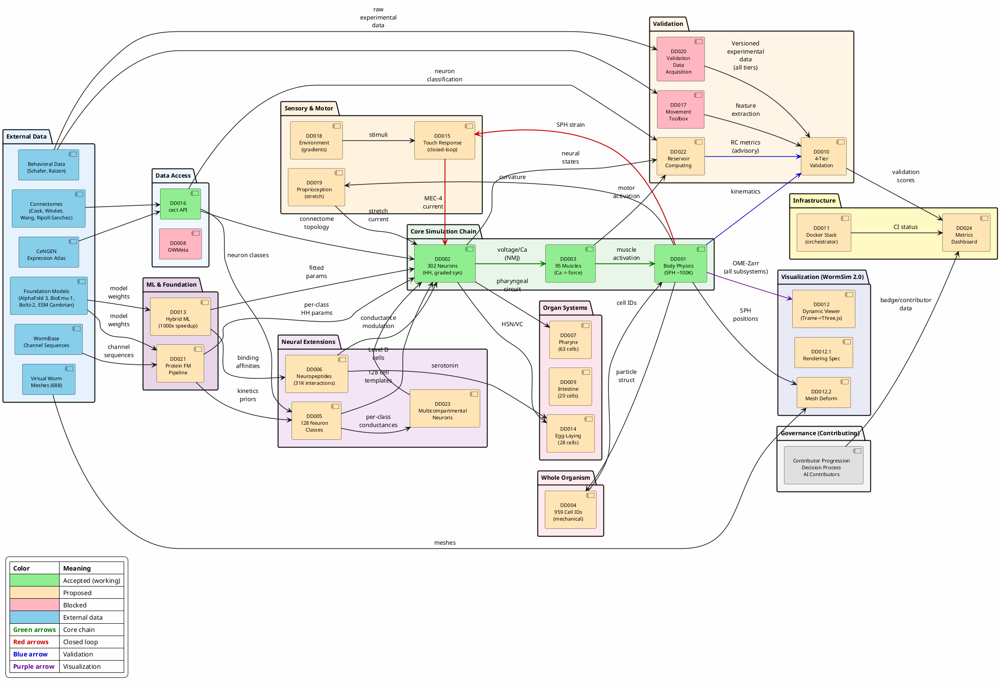

# OpenWorm Integration Map
- **Version:** 1.1
- **Created:** 2026-02-19
- **Updated:** 2026-02-22
- **Purpose:** Master coupling dependency graph showing how all Design Documents fit together

---

## Mission Alignment

**OpenWorm Mission:** "Creating the world's first virtual organism in a computer, a *C. elegans* nematode." (openworm.org)

**This Integration Map shows:** How 26 Design Documents compose into that virtual organism — each DD specifies one subsystem (neurons, muscles, body physics, pharynx, intestine, etc.), and this map shows how they couple together to produce emergent whole-organism behavior.

**Core Principle:** "Worms are soft and squishy. So our model has to be too. We are building in the physics of muscles, soft tissues and fluids. Because it matters."

**This Map enforces:** The coupling contracts that ensure physical realism — muscle calcium drives body forces (DD003→[DD001](DD001_Body_Physics_Architecture.md)), body deformation feeds back to sensory neurons ([DD001](DD001_Body_Physics_Architecture.md)→DD015), neuropeptide diffusion modulates neural excitability (DD006→DD002), and protein foundation models predict channel kinetics from sequence (DD021→DD005→DD002). Every coupling is physically meaningful, not a black-box function call.

---

## Purpose

This document visualizes **how all Design Documents couple together** at the architectural level:

- Which DDs produce data (sources)
- Which DDs consume data (sinks)
- What breaks if coupling interfaces change
- Bottleneck analysis (which DDs are critical dependencies)

**Companion to DD_PHASE_ROADMAP.md:**

- Phase Roadmap: **When** to implement (timeline view)
- Integration Map: **How** they connect (architecture view)

- **Generated from:** Integration Contract sections of DD001-DD024
- **Last updated:** 2026-02-22

---

## Complete Dependency Graph

**Reading guide:** DDs are grouped into functional clusters. Arrows show major data flows between clusters (not every internal edge). Color-coded: green = core chain, red = closed-loop, blue = validation, purple = visualization. The 4 chain diagrams below show detailed data flow for each pathway.

<object data="../../images/integration_map.svg" type="image/svg+xml" style="width:100%; max-width:1200px;">OpenWorm Integration Map — click any DD to navigate to its design document</object>

<details>
<summary>PlantUML Source (click to expand)</summary>


```plantuml
@startuml OpenWorm_Integration_Map

skinparam backgroundColor #FEFEFE
skinparam defaultTextAlignment center
skinparam ArrowThickness 1.5
skinparam PackageBorderThickness 2
skinparam PackageFontSize 13
skinparam ComponentFontSize 11
skinparam NoteFontSize 10
skinparam Padding 4
skinparam nodesep 20
skinparam ranksep 40
left to right direction

' === EXTERNAL DATA (leftmost) ===
package "External Data" as extdata #E6F3FF {
  component "Connectomes\n(Cook, Witvliet,\nWang, Ripoll-Sanchez)" as ext_conn #87CEEB
  component "CeNGEN\nExpression Atlas" as ext_cen #87CEEB
  component "Behavioral Data\n(Schafer, Raizen)" as ext_beh #87CEEB
  component "Virtual Worm\nMeshes (688)" as ext_vw #87CEEB
  component "Foundation Models\n(AlphaFold 3, BioEmu-1,\nBoltz-2, ESM Cambrian)" as ext_bio #87CEEB
  component "WormBase\nChannel Sequences" as ext_wb #87CEEB
}

' === DATA ACCESS ===
package "Data Access" as databox #F0F8FF {
  component "DD016\ncect API" as DD016 #90EE90
  component "DD008\nOWMeta" as DD008 #FFB6C1
}

' === ML & FOUNDATION (feeds into Neural Extensions and Core) ===
package "ML & Foundation" as mlbox #E8D5E8 {
  component "DD021\nProtein FM\nPipeline" as DD021 #FFE4B5
  component "DD013\nHybrid ML\n(1000x speedup)" as DD013 #FFE4B5
}

' === NEURAL EXTENSIONS (feeds into Core) ===
package "Neural Extensions" as neurext #F3E5F5 {
  component "DD005\n128 Neuron\nClasses" as DD005 #FFE4B5
  component "DD006\nNeuropeptides\n(31K interactions)" as DD006 #FFE4B5
  component "DD023\nMulticompartmental\nNeurons" as DD023 #FFE4B5
}

' === CORE CHAIN (the spine) ===
package "Core Simulation Chain" as core #E8F5E9 {
  component "DD002\n302 Neurons\n(HH, graded syn)" as DD002 #90EE90
  component "DD003\n95 Muscles\n(Ca -> force)" as DD003 #90EE90
  component "DD001\nBody Physics\n(SPH ~100K)" as DD001 #90EE90
}

' === SENSORY & MOTOR ===
package "Sensory & Motor" as sensory #FFF3E0 {
  component "DD015\nTouch Response\n(closed-loop)" as DD015 #FFE4B5
  component "DD018\nEnvironment\n(gradients)" as DD018 #FFE4B5
  component "DD019\nProprioception\n(stretch)" as DD019 #FFE4B5
}

' === ORGANS ===
package "Organ Systems" as organs #FCE4EC {
  component "DD007\nPharynx\n(63 cells)" as DD007 #FFE4B5
  component "DD009\nIntestine\n(20 cells)" as DD009 #FFE4B5
  component "DD014\nEgg-Laying\n(28 cells)" as DD014 #FFE4B5
}

' === WHOLE-ORGANISM CELL IDENTITY ===
package "Whole Organism" as whole #FFEBEE {
  component "DD004\n959 Cell IDs\n(mechanical)" as DD004 #FFE4B5
}

' === VALIDATION ===
package "Validation" as valbox #FFF5E6 {
  component "DD010\n4-Tier\nValidation" as DD010 #FFE4B5
  component "DD017\nMovement\nToolbox" as DD017 #FFB6C1
  component "DD020\nValidation\nData\nAcquisition" as DD020 #FFB6C1
  component "DD022\nReservoir\nComputing" as DD022 #FFE4B5
}

' === VISUALIZATION ===
package "Visualization (WormSim 2.0)" as visbox #E8EAF6 {
  component "DD012\nDynamic Viewer\n(Trame->Three.js)" as DD012 #FFE4B5
  component "DD012.1\nRendering Spec" as DD0121 #FFE4B5
  component "DD012.2\nMesh Deform" as DD0122 #FFE4B5
}

' === INFRASTRUCTURE ===
package "Infrastructure" as infra #FFF9C4 {
  component "DD011\nDocker Stack\n(orchestrator)" as DD011 #FFE4B5
  component "DD024\nMetrics\nDashboard" as DD024 #FFE4B5
}

' === GOVERNANCE (Contributing section) ===
package "Governance (Contributing)" as gov #F5F5F5 {
  component "Contributor Progression\nDecision Process\nAI Contributors" as GOV #E0E0E0
}

' === EDGES ===

' External -> Data Access
ext_conn --> DD016
ext_cen --> DD016
ext_beh --> DD020 : raw\nexperimental\ndata
ext_beh --> DD017

' External -> ML & Foundation
ext_bio --> DD021 : model\nweights
ext_bio --> DD013 : model\nweights
ext_wb --> DD021 : channel\nsequences

' Data Access -> Core / Neural Extensions
DD016 --> DD002 : connectome\ntopology
DD016 --> DD005 : neuron classes

' ML -> Neural Extensions / Core (FORWARD in this layout)
DD021 --> DD005 : kinetics\npriors
DD021 --> DD002 : per-class\nHH params
DD013 --> DD002 : fitted\nparams
DD013 --> DD006 : binding\naffinities

' Neural Extensions -> Core (FORWARD in this layout)
DD005 --> DD002 : 128 cell\ntemplates
DD006 --> DD002 : conductance\nmodulation

' DD023 Multicompartmental (refines DD002 neurons)
DD005 --> DD023 : per-class\nconductances
DD023 --> DD002 : Level D\ncells

' Core chain (THE SPINE)
DD002 -[#008000,bold]-> DD003 : voltage/Ca\n(NMJ)
DD003 -[#008000,bold]-> DD001 : muscle\nactivation

' Core -> Sensory & Motor
DD001 -[#CC0000,bold]-> DD015 : SPH strain
DD018 --> DD015 : stimuli
DD001 --> DD019 : curvature

' Sensory feedback -> Core (BACKWARD — only 2 remaining)
DD015 -[#CC0000,bold]-> DD002 : MEC-4\ncurrent
DD019 --> DD002 : stretch\ncurrent

' Core -> Organs
DD002 --> DD007 : pharyngeal\ncircuit
DD002 --> DD014 : HSN/VC
DD006 --> DD014 : serotonin

' Whole organism
DD001 --> DD004 : particle\nstruct
DD004 --> DD001 : cell IDs

' Core -> Validation
DD001 -[#0000CC]-> DD010 : kinematics
DD017 --> DD010 : feature\nextraction
DD020 --> DD010 : "Versioned\nexperimental\ndata\n(all tiers)"

' Core -> Visualization
DD001 -[#660099]-> DD012 : OME-Zarr\n(all subsystems)
ext_vw --> DD0122 : meshes
DD001 --> DD0122 : SPH\npositions

' RC Validation
DD002 --> DD022 : neural\nstates
DD003 --> DD022 : motor\nactivation
DD016 --> DD022 : neuron\nclassification
DD022 -[#0000CC]-> DD010 : RC metrics\n(advisory)

' Dashboard (read-only consumer)
DD011 --> DD024 : CI status
DD010 --> DD024 : validation\nscores
GOV --> DD024 : badge/contributor\ndata

' Hidden edge for layout: position Infrastructure near right side
DD001 -[hidden]-> DD011

legend bottom left
  |= Color |= Meaning |
  | <#90EE90> | Accepted (working) |
  | <#FFE4B5> | Proposed |
  | <#FFB6C1> | Blocked |
  | <#87CEEB> | External data |
  | <color:#008000>**Green arrows**</color> | Core chain |
  | <color:#CC0000>**Red arrows**</color> | Closed loop |
  | <color:#0000CC>**Blue arrow**</color> | Validation |
  | <color:#660099>**Purple arrow**</color> | Visualization |
end legend

@enduml
```

</details>

**To re-render:** Use PlantUML online (plantuml.com/plantuml) or local PlantUML jar:
```bash
java -jar plantuml.jar INTEGRATION_MAP.md
# Generates INTEGRATION_MAP.png
```

---

## Bottleneck Analysis (Most-Depended-On DDs)

**Critical Dependencies** — These DDs are consumed by the most others. Changes to their output interfaces ripple widely.

| DD | Depended On By (count) | Consumers | Criticality | Owner |
|----|----------------------|-----------|-------------|-------|
| **DD002** (Neural Circuit) | **12 DDs** | DD003, DD005, DD006, DD007, DD009, DD010, DD011, DD012, DD013, DD014, DD015, DD021 | 🔴 **CRITICAL BOTTLENECK** | Neural Circuit L4 Maintainer |
| **[DD001](DD001_Body_Physics_Architecture.md)** (Body Physics) | **7 DDs** | DD004, DD007, DD010, DD011, DD012, DD012.2, DD015 | 🔴 **CRITICAL** | Body Physics L4 Maintainer |
| **DD016** (Connectome) | **9 DDs** | DD002, DD003, DD005, DD006, DD007, DD011, DD013, DD014, DD015 | 🔴 **CRITICAL FOUNDATION** | TBD (Data L4) |
| DD003 (Muscle) | 7 DDs | [DD001](DD001_Body_Physics_Architecture.md), DD007, DD010, DD011, DD012, DD013, DD014 | 🟡 Moderate | TBD (Muscle L4) |
| DD005 (Cell-Type Specialization) | 6 DDs | DD006, DD010, DD012, DD013, DD014, DD021 | 🟡 Moderate (Phase 1+) | Neural Circuit L4 Maintainer |
| DD021 (Foundation Models) | 2 DDs | DD002 (per-class HH params), DD005 (kinetics priors) | 🟡 Moderate (Phase A2+) | TBD (ML L4) |
| DD013 (Hybrid ML) | 2 DDs | DD002 (fitted params), DD006 (binding affinities) | 🟡 Moderate (Phase 3+) | TBD (ML L4) |
| DD011 (Integration) | **0 DDs** | (Orchestrator — no one depends on it) | ℹ️ **LEAF NODE** | Integration L4 seat open to community |
| DD012 (Visualization) | **0 DDs** | (Consumer only — no one depends on it) | ℹ️ **LEAF NODE** | Visualization L4 seat open to community |
| DD017 (Toolbox) | 1 DD | DD010 (Tier 3 only) | 🟡 **BLOCKING** (for validation) | Validation L4 seat open to community |

### Phase Legend

| DD | Roadmap Phase | Status |
|----|--------------|--------|
| DD002 (Neural Circuit) | Phase 0 | Accepted |
| DD003 (Muscle) | Phase 0 | Accepted |
| DD001 (Body Physics) | Phase 0 | Accepted |
| DD016 (Connectome) | Phase 0 | Accepted |
| DD008 (Data Integration) | Phase A1 | Blocked |
| DD011 (Simulation Stack) | Phase A1 | Proposed |
| DD017 (Movement Toolbox) | Phase A1 | Blocked |
| DD020 (Validation Data) | Phase A1 | Proposed |
| DD024 (Project Metrics Dashboard) | Phase A1 | Proposed |
| [Contributor Progression](../contributing/contributor-progression.md) | Governance (Contributing section) | Active |
| [Decision Process](../contributing/decision-process.md) | Governance (Contributing section) | Active |
| [AI Contributors](../contributing/ai-contributors.md) | Governance (Contributing section) | Active |
| DD021 (Foundation Models) | Phase A2 | Proposed |
| DD005 (Cell-Type Specialization) | Phase 1 | Proposed |
| DD010 (Validation Framework) | Phase 1 | Proposed |
| DD012 (Visualization) | Phase 1-4 | Proposed |
| DD013 (Hybrid ML) | Phase 3 | Proposed |
| DD023 (Multicompartmental) | Phase 2 | Proposed |

**Key Insight:**

- **DD002 is the central hub** — 12 other DDs depend on it. Any change to neural output format (calcium variables, voltage traces, [OME-Zarr](https://ngff.openmicroscopy.org) schema) affects almost everything.
- **DD011 and DD012 are pure consumers** — They orchestrate/visualize but don't produce data that other DDs depend on. This is correct (leaf nodes in the dependency graph).
- **DD016 is the foundational data layer** — 9 DDs pull connectome data from it. If `cect` API changes or default dataset switches, widespread updates needed.
- **DD021 and DD013 are ML feeders** — They consume external foundation models (AlphaFold 3, BioEmu-1, Boltz-2, ESM Cambrian) and produce predicted parameters for the mechanistic core. DD021 feeds DD002/DD005 (channel kinetics); DD013 feeds DD002 (fitted params) and DD006 (binding affinities).

---

## Coupling Chains (Data Flow Sequences)

### Chain 1: The Core Loop (Neural → Muscle → Body → Validation)

**Primary data flow** through the simulation:

<object data="../../images/chain1_core_loop.svg" type="image/svg+xml" style="width:100%; max-width:900px;">Chain 1: Core Loop</object>

**Coupling scripts:**

- NeuroML/LEMS handles DD002→DD003 (within same simulation)
- `sibernetic_c302.py` handles DD003→[DD001](DD001_Body_Physics_Architecture.md) (file-based coupling)
- [WCON](https://github.com/openworm/tracker-commons) exporter in `master_openworm.py` handles [DD001](DD001_Body_Physics_Architecture.md)→DD017
- Validation scripts handle DD017→DD010

**Phase Status:** The core loop (DD002→DD003→DD001→DD017→DD010) is the only coupling chain that is **fully working today** (Phase 0). All other chains (Cell-Type, Closed-Loop, Visualization, Foundation Models) are Phase 1+.

**Two trajectory generation paths (both produce WCON 1.0):**

| Path | Tool | Physics | Speed | Use Case |
|------|------|---------|-------|----------|
| **2D fast path** | `boyle_berri_cohen_trajectory.py` (c302 repo) | 2D rod-spring, ~150 variables | Seconds (CPU) | CI quick-test, parameter sweeps, DD013 training data |
| **Sibernetic full path** | `sibernetic_c302.py` → Sibernetic → `wcon/generate_wcon.py` (existing) or `extract_trajectory.py` (DD002 Issue 2) | 3D SPH, ~100K particles | Minutes-hours (GPU) | Publication validation, 3D analysis, DD015 strain |

Both paths feed identically into DD017 → DD010. The 2D fast path wraps the Boyle, Berri & Cohen (2012) published rod-spring model, already implemented in `openworm/CE_locomotion`, `openworm/Worm2D`, and `openworm/CelegansNeuromechanicalGaitModulation`.

**Phase Status:** The Sibernetic full path works today (Phase 0). The 2D fast path (`boyle_berri_cohen_trajectory.py`) is a Phase A1 deliverable (DD002 Issue 1).

**2D model limitations:** 2D only. Cannot replace Sibernetic for DD004 (cell identity), DD015 (3D cuticle strain), DD012.2 (mesh deformation), or Phase 3+ organ systems.

**What breaks if:**

- DD002 changes `ca_internal` variable name → DD003 can't read muscle calcium
- DD003 changes activation file format → [DD001](DD001_Body_Physics_Architecture.md) reads wrong forces
- [DD001](DD001_Body_Physics_Architecture.md) changes particle output or WCON schema → DD017 parser fails
- DD017 changes feature definitions → DD010 acceptance thresholds may need recalibration

---

### Chain 2: Cell-Type Specialization (CeNGEN → Conductances → Functional Connectivity)

**Phase 1 validation chain:**

<object data="../../images/chain2_cell_differentiation.svg" type="image/svg+xml" style="width:100%; max-width:900px;">Chain 2: Cell-Type Specialization</object>

**What breaks if:**

- DD008 CeNGEN query format changes → DD005 calibration pipeline fails
- DD005 conductance formula changes → All 128 neuron classes change → Tier 2 correlation shifts
- DD010 changes Tier 2 acceptance threshold → Previously passing simulations may now fail

---

### Chain 3: Bidirectional Closed-Loop Touch (DD015 Closes the Loop)

**New in Phase 2** — adds reverse path (body → sensory):

<object data="../../images/chain3_closed_loop.svg" type="image/svg+xml" style="width:100%; max-width:900px;">Chain 3: Closed-Loop Touch</object>

**Coupling script:**

- `sibernetic_c302_closedloop.py` extends `sibernetic_c302.py` with bidirectional communication

**Stability requirement:**
Closed-loop coupling can cause **oscillatory instability** if:

- Touch neuron gain too high (strain → current → motor → movement → more strain → positive feedback)
- Timestep mismatch between neural (0.05ms) and body (0.02ms) physics
- MEC-4 adaptation dynamics insufficient (no low-pass filtering on strain)

DD015 Quality Criteria (line 602): "Closed-loop must remain stable for ≥30 seconds without NaN, divergence, or oscillatory instability."

---

### Chain 4: All Subsystems → Visualization (OME-Zarr Export)

**Every science DD exports to OME-Zarr for the viewer:**

<object data="../../images/chain4_visualization.svg" type="image/svg+xml" style="width:100%; max-width:900px;">Chain 4: Visualization Pipeline</object>

**Coupling owner:**

- **Integration L4** owns the OME-Zarr export step in `master_openworm.py` (DD011 Step 4b)
- **Visualization L4** owns the viewer (DD012) and rendering spec (DD012.1)
- **Each science DD** owns producing its OME-Zarr group in the correct format

**What breaks if:**

- Any DD changes its OME-Zarr group schema (shape, data type, chunk size) → Viewer can't parse it
- DD012 changes the OME-Zarr hierarchy (renames groups, adds required metadata) → All science DDs must update export
- DD012.1 changes activity color mapping (voltage range, colormap) → Not a breaking change, purely visual

---

### Chain 5: Foundation Models → Mechanistic Parameters

**New in v1.1** — external protein foundation models predict parameters for the mechanistic core:

```
WormBase sequences ──→ DD021 (Protein FM Pipeline) ──→ DD005 (kinetics priors)
                          │                                    │
Foundation models ─────────┤                              DD002 (per-class HH params)
(AlphaFold 3, BioEmu-1,  │
 Boltz-2, ESM Cambrian)  └──→ DD013 (Hybrid ML Framework)
                                    │
                                    ├──→ DD002 (auto-fitted params)
                                    └──→ DD006 (binding affinities)
```

**Data flow:**

1. **Ion channel kinetics** (DD021): Gene sequence → AlphaFold 3/Boltz-2 (structure) → BioEmu-1 (dynamics) → ESM Cambrian (embeddings) → predicted HH parameters (V_half, slope, tau) → feed into DD005 calibration and DD002 per-class models
2. **Neuropeptide binding affinities** (DD013→DD006): Peptide + receptor sequences → Boltz-2/AlphaFold 3 (complex structure) → predicted K_d values → differentiated k_on/k_off in DD006

**What breaks if:**

- Foundation model APIs or weights change (e.g., AlphaFold 4 replaces AlphaFold 3) → DD021 pipeline must be revalidated; downstream parameters shift
- DD005 changes the expression→conductance formula → DD021 priors must be recalibrated against the new formula
- Cross-validation thresholds not met (<30% error) → DD021 predictions are not adopted; DD005 falls back to expression-only calibration

**Key difference from Chains 1-4:** This chain runs *offline* (pre-simulation). Foundation model predictions are computed once and stored as CSV/YAML parameter files. The simulation itself never calls foundation model APIs at runtime.

---

## Interface Criticality Matrix

**Which coupling interfaces are most fragile / highest-impact if changed?**

| Interface | Producer | Consumer | Format | Criticality | Why |
|-----------|----------|----------|--------|-------------|-----|
| **Muscle calcium → Sibernetic activation** | DD003 | [DD001](DD001_Body_Physics_Architecture.md) | Tab-separated file | 🔴 **CRITICAL** | File format, muscle count, activation range [0,1] — if any change, body physics breaks |
| **OME-Zarr schema** | DD002-DD015 (10+ producers) | DD012 | Zarr directory structure | 🔴 **CRITICAL** | 10+ DDs export, 1 DD consumes — coordination nightmare if schema changes |
| **WCON format** | DD002 (2D fast path) or [DD001](DD001_Body_Physics_Architecture.md) (Sibernetic full path) | DD017 | JSON (WCON 1.0 spec) | 🟡 **MODERATE** | WCON is external standard (tracker-commons), unlikely to change |
| **`cect` API** | DD016 | DD002-DD015 (9 DDs) | Python classes (ConnectomeDataset, ConnectionInfo) | 🟡 **MODERATE** | ConnectomeToolbox maintainer maintains `cect`, API is stable, v0.2.7 →0.3.0 should be backward-compatible |
| **Connectome topology (adjacency matrices)** | DD016 | DD002 | NumPy arrays | 🟢 **LOW** | Topology is biological ground truth, rarely changes (only with new EM data) |
| **CeNGEN expression** | DD008/DD016 | DD005 | CSV or OWMeta query | 🟢 **LOW** | Expression data is fixed per CeNGEN version (L4 v1.0), won't change unless re-analysis |
| **Foundation model predictions → DD005/DD002** | DD021 | DD005, DD002 | CSV (HH parameters) | 🟡 **MODERATE** | Predictions change when models are updated (AlphaFold 3→4, new ESM version); downstream parameters shift, requiring revalidation against DD010 |
| **Foundation model binding affinities → DD006** | DD013 | DD006 | CSV (K_d values) | 🟢 **LOW** | Predicted affinities are optional enhancement; DD006 falls back to uniform defaults if unavailable |

**Recommendation:**

- **High-criticality interfaces** (muscle→body, OME-Zarr) should have **integration tests** that run on every PR touching the interface
- **Medium-criticality** (WCON, cect, foundation model predictions) should be version-pinned in `versions.lock` (DD011)
- **Low-criticality** (topology, expression) can rely on upstream data versioning

---

## Responsibility Matrix (Who Owns Integration at Each Boundary?)

| Coupling Boundary | Upstream DD | Downstream DD | Coupling Script / Location | Owner (L4 Maintainer) | Coordination Required |
|-------------------|------------|--------------|---------------------------|----------------------|---------------------|
| **Neural → Muscle** | DD002 | DD003 | NeuroML/LEMS (same simulation) | Neural Circuit L4 Maintainer | Low (tightly coupled, same codebase) |
| **Muscle → Body** | DD003 | [DD001](DD001_Body_Physics_Architecture.md) | `sibernetic_c302.py` (openworm/sibernetic) | **Integration L4** + Body Physics L4 | High (file format, different repos) |
| **Body → Sensory (NEW)** | [DD001](DD001_Body_Physics_Architecture.md) | DD015 | `sibernetic_c302_closedloop.py` (openworm/sibernetic) | **Integration L4** + Body Physics L4 + Neural L4 | **VERY HIGH** (bidirectional, stability risk) |
| **All → OME-Zarr Export** | DD002-DD015 | DD012 | `master_openworm.py` Step 4b | **Integration L4** | **VERY HIGH** (10+ producers, 1 schema) |
| **Simulation → WCON** | [DD001](DD001_Body_Physics_Architecture.md) | DD017 | WCON exporter in `master_openworm.py` | **Integration L4** + Validation L4 | Moderate (WCON spec is external standard) |
| **Connectome → All** | DD016 | DD002+ (9 DDs) | `cect` Python API | Data L4 (TBD) + ConnectomeToolbox maintainer | Low (stable API, ConnectomeToolbox maintainer maintains both sides) |
| **CeNGEN → Calibration** | DD008/DD016 | DD005 | OWMeta query or direct download | Data L4 (TBD) + Neural L4 | Low (expression data is fixed per version) |
| **Foundation Models → Channel Kinetics** | DD021 | DD005, DD002 | `generate_dd005_priors.py` (openworm/openworm-ml) | ML L4 (TBD) + Neural L4 | Moderate (predictions must pass cross-validation before adoption) |
| **Foundation Models → Binding Affinities** | DD013 | DD006 | Foundation model inference scripts (openworm/openworm-ml) | ML L4 (TBD) + Neural L4 | Low (optional enhancement, DD006 has uniform defaults as fallback) |

**Key Finding:**
**5 of 9 coupling boundaries require Integration L4** — this is why the role is critical. The Integration Maintainer is the **coupling bridge owner** for muscle→body, body→sensory, all→OME-Zarr, simulation→WCON, and orchestration. The 2 new foundation model boundaries require **ML L4** coordination with Neural L4.

---

## When Integration L4 Must Be Consulted

### Scenario 1: DD Changes an Output Interface

**Example:** DD002 PR proposes renaming `ca_internal` to `calcium_concentration`.

**Integration L4 workflow:**

1. **Mind-of-a-Worm flags PR:** "⚠️ **Integration alert:** This PR modifies calcium output variable name (DD002 Integration Contract). DD003 (Muscle), DD006 (Neuropeptides), DD009 (Intestinal feedback), and DD012 (Visualization) consume this output. Tagging maintainers."
2. **Integration L4 reviews:** Checks DD003, DD006, DD009, DD012 code for `ca_internal` references
3. **Coordination:** Opens issues on each consuming DD: "Update calcium variable name from ca_internal to calcium_concentration (DD002 change)"
4. **Synchronization:** All consuming DDs must update simultaneously (coordinated merge)
5. **Validation:** Run full integration test (`docker compose run validate`) after all merges

### Scenario 2: DD Adds a New OME-Zarr Group

**Example:** DD006 (neuropeptides) is implemented, adds `neuropeptides/concentrations/` group.

**Integration L4 workflow:**

1. **DD006 PR merged:** `master_openworm.py` Step 4b updated to export peptide concentrations
2. **Integration L4 updates DD012:** Add `neuropeptides/` layer to viewer layer spec
3. **Visualization L4 implements:** Volumetric rendering in Trame viewer
4. **Integration test:** `docker compose run viewer` loads peptide data without error

### Scenario 3: Multiple DDs Change Simultaneously

**Example:** Phase 2 implementation — DD006 (neuropeptides) and DD015 (touch) both modify DD002.

**Integration L4 workflow:**

1. **Coordinate merge order:** DD015 first (adds MEC-4 channel to touch neurons), then DD006 (adds peptide components)
2. **Integration test after each:** Run `docker compose run validate` after DD015 merge, again after DD006 merge
3. **Regression detection:** If Tier 3 kinematics degrade after DD015, block DD006 until fixed
4. **Update Integration Map:** Add new edges (DD015→DD002, DD006→DD002) to this document

---

## Coupling Scripts Inventory (Critical Codebases)

**These scripts implement the Integration Contracts.** Changes here affect multiple DDs.

| Script | Location | What It Does | Producer DD | Consumer DD | Owner |
|--------|----------|--------------|------------|-------------|-------|
| **`sibernetic_c302.py`** | `openworm/sibernetic` | Reads muscle calcium from NEURON, converts to activation, writes to Sibernetic | DD003 | [DD001](DD001_Body_Physics_Architecture.md) | Integration L4 + Body Physics L4 |
| **`sibernetic_c302_closedloop.py`** | `openworm/sibernetic` (to be created) | Extends above with strain readout (SPH → touch neurons) | [DD001](DD001_Body_Physics_Architecture.md) | DD015 | Integration L4 + Body Physics L4 + Neural L4 |
| **`master_openworm.py`** | `openworm/OpenWorm` | Orchestrates all subsystems, exports OME-Zarr | DD011 | All | **Integration L4** |
| **OME-Zarr export (Step 4b)** | Inside `master_openworm.py` | Collects all subsystem outputs, writes openworm.zarr/ | DD002-DD015 | DD012 | **Integration L4** |
| **WCON exporter** | `openworm/sibernetic/wcon/generate_wcon.py` (existing; to be adapted per DD002 Issue 2) | Reads position_buffer.txt, computes curvature/angles, exports WCON 1.0 JSON with schema validation | [DD001](DD001_Body_Physics_Architecture.md) | DD017 | Integration L4 + Validation L4 |
| **`boyle_berri_cohen_trajectory.py`** | `openworm/c302/scripts/` (to be created) | Reads c302 muscle calcium, runs Boyle-Cohen 2D rod-spring model, outputs WCON trajectory | DD002/DD003 | DD017, DD010 | Neural Circuit L4 Maintainer |
| **c302 network generation** | `openworm/c302` (`CElegans.py`) | Reads connectome via `cect`, generates NeuroML | DD016 | DD002 | Neural Circuit L4 Maintainer |
| **Strain readout module** | `openworm/sibernetic/coupling/strain_readout.py` (to be created) | Computes local strain from particle displacements | [DD001](DD001_Body_Physics_Architecture.md) | DD015 | Body Physics L4 + Integration L4 |
| **`predict_kinetics.py`** | `openworm/openworm-ml/foundation_params/scripts/` (to be created) | Predicts HH kinetic parameters from ion channel sequences via AlphaFold 3 + BioEmu-1 + ESM Cambrian | External (foundation models, WormBase) | DD021 | ML L4 (TBD) |
| **`generate_dd005_priors.py`** | `openworm/openworm-ml/foundation_params/scripts/` (to be created) | Combines DD021 kinetics predictions with CeNGEN expression to produce per-class HH parameter sets | DD021 | DD005, DD002 | ML L4 (TBD) + Neural L4 |

**Critical observation:**
`master_openworm.py` is the **integration bottleneck** — it orchestrates everything. This is why DD011 (which specifies `master_openworm.py`'s architecture) and the Integration L4 role are so critical. The foundation model scripts (`openworm-ml`) run *offline* and produce static parameter files — they do not require runtime orchestration by `master_openworm.py`.

---

## Recommended Actions for Subsystem Maintainers

### For Neural Circuit L4 Maintainer (DD002, DD005, DD006)

**When modifying DD002 outputs:**

1. Check Integration Contract "Depends On Me" table (lines 473-479 in DD002)
2. Identify consuming DDs: DD003 (muscle), DD006 (peptides), DD009 (intestinal feedback), DD010 (validation), DD011 (integration), DD012 (visualization), DD013 (ML), DD014 (egg-laying), DD015 (touch)
3. **If changing calcium variable name, file format, or OME-Zarr schema:** Tag Integration L4 and all consuming DD maintainers
4. **If adding a new neuron or channel:** Low coordination (internal to DD002)
5. **If changing connectome data source (DD016 → different dataset):** High coordination (affects all 302 neurons)

### For Body Physics L4 Maintainer ([DD001](DD001_Body_Physics_Architecture.md), DD004)

**When modifying [DD001](DD001_Body_Physics_Architecture.md) outputs:**

1. Check "Depends On Me" table ([DD001](DD001_Body_Physics_Architecture.md) lines 489-493)
2. Identify consumers: DD004 (cell identity), DD007 (pharynx mechanics), DD010 (kinematics), DD011 (integration), DD012 (visualization), DD012.2 (mesh deformation), DD015 (strain readout)
3. **If changing particle struct (adding fields):** DD004 must update particle initialization
4. **If changing WCON output:** DD017 parser must be tested
5. **If changing OME-Zarr schema for body/positions/:** DD012 and DD012.2 must update

### For Integration L4 (TBD — DD011)

**Ongoing responsibilities:**

1. **Review all PRs that modify coupling scripts** (sibernetic_c302.py, master_openworm.py, OME-Zarr export)
2. **Run integration tests** after merging PRs to DD002, DD003, [DD001](DD001_Body_Physics_Architecture.md) (the core chain)
3. **Update this Integration Map** when new DDs are added or coupling changes
4. **Coordinate simultaneous merges** when multiple DDs change interfaces (Phase 2, Phase 3 multi-DD implementations)
5. **Maintain `versions.lock`** — pin all subsystem commits together for each release

### For Validation L4 (TBD — DD010, DD017)

**Ongoing responsibilities:**

1. **Maintain analysis toolbox** (DD017) — keep it working on latest Python, update dependencies
2. **Curate validation datasets** — Schafer kinematics, Randi functional connectivity, behavioral assays
3. **Update acceptance criteria** in DD010 if biological ground truth changes (new experimental data)
4. **Review regression reports** from CI — escalate Tier 2/3 failures to relevant subsystem maintainers

### For Visualization L4 (TBD — DD012, DD012.1, DD012.2)

**Ongoing responsibilities:**

1. **Implement viewer features** per DD012 Phase 1-3 roadmap
2. **Update color mappings** in DD012.1 if new cell types added (e.g., pharynx, intestine)
3. **Maintain OME-Zarr import** — when science DDs add new groups, update viewer to display them
4. **Performance optimization** — keep rendering at 60fps as dataset size grows

### For ML L4 (TBD — DD013, DD021)

**Ongoing responsibilities:**

1. **Maintain foundation model pipeline** (DD021) — keep inference scripts working as upstream models update (AlphaFold 3→4, new ESM versions)
2. **Version-pin model weights** — record exact model versions (checksums) used for each set of predictions in `foundation_params/models/VERSIONS.md`
3. **Revalidate on model updates** — when a new foundation model version is released, re-run cross-validation (DD021 Step 4) and compare error rates against previous version
4. **Coordinate with Neural L4** when predicted parameters change — any shift in per-class HH parameters requires DD010 Tier 2 revalidation
5. **Track foundation model ecosystem** — monitor new releases of AlphaFold, ESM, Boltz, BioEmu and similar models that could improve predictions (e.g., protein dynamics models, binding affinity predictors)

---

## Version Control and Release Coordination

**When we release a new OpenWorm version (e.g., v0.10.0):**

1. **Integration L4 creates release branch:** `release/v0.10.0`
2. **Pin all subsystem commits in `versions.lock`:**
   ```yaml
   c302:
     commit: "abc123..."
     tag: "ow-0.10.0"
   sibernetic:
     commit: "def456..."
     tag: "ow-0.10.0"
   cect:
     pypi_version: "0.2.7"
   open_worm_analysis_toolbox:
     commit: "ghi789..."
     tag: "revival-0.1.0"
   openworm_ml:
     commit: "jkl012..."
     tag: "ow-0.10.0"
     foundation_model_versions:
       alphafold3: "v3.0.0"
       bioemu1: "v1.0.0"
       esm_cambrian: "esm-c-300m-2024-12"
   ```

3. **Run full validation suite:** All Tier 1-3 tests on the pinned combination
4. **Tag release** if validation passes
5. **Publish Docker image** to Docker Hub: `openworm/openworm:0.10.0`
6. **Announce milestone** (see DD_PHASE_ROADMAP milestones)

**All component repos** (c302, Sibernetic, ConnectomeToolbox, openworm-ml) also tag their versions (`ow-0.10.0`) so releases are traceable. For `openworm-ml`, foundation model weight versions are also recorded since upstream model updates can change predictions.

---

## Integration Test Suite (What Integration L4 Runs)

**Per-PR (quick-test):**
```bash
docker compose run quick-test
# Checks:
#   - Build succeeds (all subsystems compile)
#   - Simulation runs ≥5s without crash
#   - Output files exist (*.wcon, *.png, *.dat)
#   - No NaN in any output variable
# Time: <5 minutes
```

**Pre-merge (validate):**
```bash
docker compose run validate
# Checks:
#   - Tier 2: Functional connectivity r > 0.5 (if DD005 implemented)
#   - Tier 3: Kinematics within ±15% of baseline
#   - Tier 3: Organ-specific (pumping, defecation, egg-laying) if enabled
#   - Integration stability: coupled sim runs ≥30s without divergence
# Time: <2 hours
```

**Pre-release (full suite):**
```bash
docker compose run validate --config full_validation
# Checks:
#   - All Tier 1-3 validation
#   - Multi-dataset cross-validation (Cook2019 vs. Witvliet8)
#   - Backward compatibility (all `enabled: false` flags tested)
#   - Performance benchmarks (time per frame, memory usage)
#   - Visual inspection (screenshots match reference mockups)
# Time: 4-8 hours
```

---

## Open Issues / Future Improvements

### Issue 1: No Automated Coupling Interface Detection

**Problem:** When a DD changes an output variable, **Mind-of-a-Worm must manually parse the Integration Contract** to identify consumers.

**Future:** Build a static analyzer that:

- Parses all DD Integration Contract tables
- Builds coupling graph programmatically
- Auto-generates "Depends On Me" alerts when a PR touches a coupling interface

**Tool:** `scripts/analyze_coupling.py` (to be created)

### Issue 2: Integration Tests Are Not DD-Specific

**Problem:** `docker compose run validate` runs the full test suite. If DD006 changes and Tier 3 fails, we don't know if DD006 caused it or if it's an unrelated issue.

**Future:** Add **per-DD integration tests**:
```bash
docker compose run test-dd006  # Only validates DD006 coupling (peptides → neural)
docker compose run test-dd015  # Only validates DD015 coupling (body → sensory)
```

### Issue 3: Coupling Scripts Have No Owners in Integration Contracts

**Problem:** DD003 Integration Contract doesn't name who owns `sibernetic_c302.py`. Is it Body Physics L4, Neural L4, or Integration L4?

**Future:** Add "Coupling Script Owner" row to Integration Contract tables:
```markdown
| Coupling Script | Location | Owner |
|----------------|----------|-------|
| `sibernetic_c302.py` | openworm/sibernetic | Integration L4 + Body Physics L4 (co-owned) |
```

---

- **Approved by:** Pending (awaiting founder review)
- **Maintained by:** Integration L4 Maintainer (when appointed)
- **Next Update:** After Phase A1 (reassess coupling graph based on actual DD011 implementation and DD021 cross-validation results)
