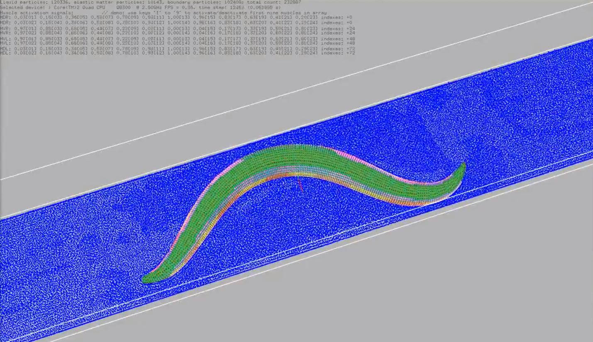

OpenWorm Modeling Approach
==========================

## Mission

Our main goal is to build the world's first virtual organism — an *in silico* implementation of a living creature — for the purpose of achieving an understanding of the events and mechanisms of living cells.

**This is now formalized in 29 Design Documents (DD002-DD024, plus DD012.1 and DD012.2)** that specify every subsystem from ion channels to organism behavior, validated against experimental data.

---

## From Prototype to Production (2011-2026)

### The Early Vision (2011-2014): CyberElegans Prototype

When OpenWorm started, we built a prototype ([CyberElegans](https://github.com/openworm/CyberElegans), 2014) demonstrating the core idea: simulate neurons, muscles, and body physics in a coupled loop to produce emergent locomotion.

[Watch the CyberElegans prototype](https://www.youtube.com/watch?v=3uV3yTmUlgo)

This prototype proved the concept worked. But it was:

- Not validated against experimental data
- Hardcoded parameters (not tunable)
- 302 identical neurons (not biologically differentiated)
- No organ systems (pharynx, intestine, reproductive)

### The Current Architecture (2018-2026): Design Document Era

**Today, OpenWorm is built on formal Design Documents** that specify:

- **DD002: Neural Circuit** — 302-neuron HH model, graded synapses, validated kinematics
- **DD003: Muscle Model** — Calcium-force coupling, [Boyle & Cohen 2008](https://doi.org/10.1016/j.biosystems.2008.05.025) parameters
- **[DD001: Body Physics](design_documents/DD001_Body_Physics_Architecture.md)** — Sibernetic SPH, ~100K particles, PCISPH pressure solver

**These three DDs (the "core chain") are WORKING and VALIDATED:**

- 15ms simulations produce emergent locomotion
- Validated against Schafer lab kinematics (speed, wavelength, frequency within +/-15%)
- Published: [Sarma et al. 2018](https://doi.org/10.1098/rstb.2017.0382), [Gleeson et al. 2018](https://doi.org/10.1098/rstb.2017.0379)

[Watch the current simulation](https://www.youtube.com/watch?v=SaovWiZJUWY)

---

## The Multi-Scale Architecture

OpenWorm doesn't model at one scale — it models at **five scales simultaneously**, coupled together:

| Scale | Time | Space | Design Documents | Validation |
|-------|------|-------|------------------|------------|
| **Molecular** | Microseconds | Angstroms | DD013 (foundation models to params) | Protein structures (AlphaFold) |
| **Channel** | Milliseconds | Nanometers | DD002 (HH channels), DD005 (CeNGEN to conductances) | Patch clamp electrophysiology |
| **Cellular** | Milliseconds-seconds | Micrometers | DD002 (neurons), DD003 (muscles), DD007-DD009 (organs) | Calcium imaging, EMG |
| **Tissue** | Seconds | Hundreds of um | [DD001](design_documents/DD001_Body_Physics_Architecture.md) (body physics), DD004 (cell identity) | Kinematics, organ function |
| **Organism** | Seconds-minutes | Millimeters | DD010 (behavioral validation), DD015 (closed-loop) | Behavioral assays |

**This is what makes OpenWorm unique** compared to other computational biology projects:

- Virtual Cell projects (CZI, Arc) focus on single-cell molecular scale
- Connectome projects focus on neural wiring
- OpenWorm is the **only project** coupling all 5 scales into a single whole-organism simulation

---

## The Causal Loop (Bottom-Up + Validated)

Inspired by [Robert Rosen's work on causal loops](https://www.amazon.com/Life-Itself-Comprehensive-Fabrication-Complexity/dp/0231075650) (referenced in DD002), OpenWorm focuses on the sensorimotor loop as the minimum core:

<object data="../images/causal_loop.svg" type="image/svg+xml" style="width:100%; max-width:900px;">OpenWorm Sensorimotor Causal Loop — click any DD to navigate</object>

**DD015 (Closed-Loop Touch Response)** closes this loop — the worm can sense its environment (cuticle strain to MEC-4 channels to neural response to motor pattern to movement).

---

## Components (Now Fully Specified)

### Body and Environment

**Historical (2014):** CyberElegans prototype demonstrated SPH body physics

**Current Specifications:**

- **[DD001](design_documents/DD001_Body_Physics_Architecture.md) (Body Physics):** PCISPH algorithm, ~100K particles (liquid, elastic, boundary), validated
- **DD004 (Mechanical Cell Identity):** Per-particle cell IDs, 959 somatic cells, cell-type-specific elasticity
- **DD018 (Environment):** Substrates (agar, liquid, soil), chemical/thermal gradients, food particles

**Implementation:** [Sibernetic repository](Projects/sibernetic/)

### Neurons

**Historical:** 302-neuron NeuroML connectome (all neurons identical)

**Current Specifications:**

- **DD002 (Neural Circuit):** Multi-level HH framework (Levels A-D), graded synapses (Level C1 default)
- **DD005 (Cell-Type Specialization):** 128 distinct neuron classes from CeNGEN single-cell transcriptomics
- **DD006 (Neuropeptides):** 31,479 peptide-receptor interactions ([Ripoll-Sanchez 2023](https://doi.org/10.1016/j.neuron.2023.09.043)), slow modulation
- **DD007 (Pharynx):** 20 pharyngeal neurons (semi-autonomous pumping circuit)
- **DD014 (Egg-Laying):** 2 HSN serotonergic + 6 VC cholinergic neurons (two-state pattern)
- **DD015 (Touch):** 6 touch receptor neurons (MEC-4 mechanotransduction)
- **DD019 (Proprioception):** B-class motor neuron stretch receptors

**Implementation:** [c302 repository](Projects/c302/)

### Muscle Cells

**Historical:** Generic muscle model

**Current Specifications:**

- **DD003 (Body Wall):** 95 muscles, HH conductances 10-1000x smaller than neurons
- **DD007 (Pharyngeal):** 20 pharyngeal muscles, plateau potentials, gap-junction-synchronized
- **DD014 (Reproductive):** 16 sex muscles (8 vulval, 8 uterine), EGL-19/UNC-103 channels

**Implementation:** [c302 repository](Projects/c302/) + [muscle_model repository](https://github.com/openworm/muscle_model)

### Organs (New!)

**Added in Phase 5:**

- **DD007 (Pharynx):** 63-cell semi-autonomous organ, 3-4 Hz pumping
- **DD009 (Intestine):** 20-cell IP3/Ca oscillator, 50s defecation motor program
- **DD014 (Egg-Laying):** 28-cell reproductive circuit

These weren't in the original vision but are now formalized with quantitative validation targets.

---

## Validation (Now 3-Tier Framework)

**Historical:** "Movement validation project" (vague)

**Current Specification: DD010: Validation Framework**

| Tier | What | Validation Data | Blocking? |
|------|------|----------------|-----------|
| **Tier 1** | Single-cell electrophysiology | Goodman lab patch clamp | No (warning) |
| **Tier 2** | Circuit functional connectivity | [Randi 2023](https://doi.org/10.1038/s41586-023-06683-4) whole-brain imaging | **YES** (r > 0.5) |
| **Tier 3** | Behavioral kinematics | Schafer lab WCON database | **YES** (+/-15%) |

**Tool:** [open-worm-analysis-toolbox](https://github.com/openworm/open-worm-analysis-toolbox) (being revived per DD017)

More details available on the [Validation page](validation/).

---

## Tuning and Optimization

**Historical:** "Use genetic algorithms to search parameter space"

**Current Specification: DD013: Hybrid Mechanistic-ML Framework**

4 components:

1. **Differentiable simulation backend** — PyTorch ODE solver, gradient descent auto-fitting
2. **Neural surrogate for SPH** — FNO learns muscle-to-movement mapping, 1000x speedup
3. **Foundation model to ODE parameters** — ESM3/AlphaFold predict channel kinetics from gene sequences
4. **Learned sensory transduction** — RNN learns stimulus-to-neuron response (chemotaxis, thermotaxis)

**The mechanistic core (DD002-003 HH+SPH equations) is preserved.** ML operates at boundaries (parameter fitting, acceleration, sensory front-end), never replacing causal interpretability.

---

## Reproducibility (Platform Evolution)

**Historical:** [Geppetto](https://geppetto.org) (2014-2020) — Java-based web platform for multi-algorithm simulation

**Current Specification: DD012: Dynamic Visualization**

- **Phase 3:** Trame viewer (PyVista + live server, organism + tissue scales)
- **Phase 4:** Interactive layers (neuropeptides, organs, validation overlay)
- **Phase 5:** Three.js + WebGPU static site, molecular scale, wormsim.openworm.org (WormSim 2.0)

**Why the evolution from Geppetto?** DD012 Alternatives Considered: Geppetto is Java-based, requires per-client server processes, not updated for WebGPU. Trame is lighter, Python-native (matches contributor skillset), actively maintained.

Geppetto is preserved as [historical documentation](archived_projects/) and in the [GitHub repository](https://github.com/openworm/geppetto).

---

## Integration (Now Formal Architecture)

**Historical:** "Multi-algorithm integration" concept (no formal spec)

**Current Specification: DD011: Simulation Stack**

- openworm.yml config system (single source of truth)
- Multi-stage Docker build (neural, body, validation, viewer stages)
- docker-compose.yml (quick-test, simulation, validate services)
- versions.lock (pin exact commits for reproducibility)
- Integration Maintainer role (coordinates coupling between DDs)

**Each DD's Integration Contract** specifies exactly what it consumes and produces, ensuring composability.

---

## What's Next

The path from today's 302-neuron simulation to the complete 959-cell organism is organized into a phased implementation roadmap, progressing through cell-type specialization, sensory integration, organ systems, and finally the full organism with photorealistic visualization. See the [Implementation Roadmap](design_documents/#phase-overview) for the complete phase-by-phase plan with milestones and Design Document assignments.

**Contribute:** Check the [Design Documents](design_documents/) for areas that match your skills, then follow the [DD contribution workflow](Community/github/#contributing-to-design-document-implementation).
